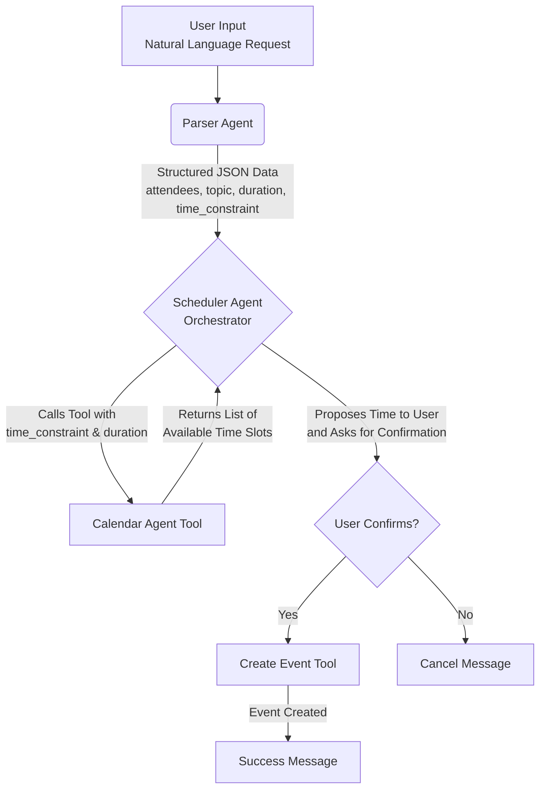

# CalPal - The Smart Meeting Scheduler Agent

CalPal is a command-line intelligent scheduling assistant that uses AI agents to parse natural language requests and manage your Google Calendar. Simply tell CalPal what meeting you want to schedule, and it will find a time and book it for you.

## 🎯 Features

- **Natural Language Processing**: Describe your meeting in plain English (e.g., "Lunch with Alex next Thursday at 1pm").
- **Calendar Integration**: Directly checks your Google Calendar's availability to find a free slot.
- **Automated Scheduling**: Creates calendar events with attendees, topic, and duration automatically.
- **Agent-Based Architecture**: Built using LangChain, showcasing a clear multi-agent workflow.

## 🤖 How It Works (Agent Architecture)

CalPal uses a system of specialized agents that work together to complete the scheduling task.



## 🚀 Quick Start

### Installation

1. **Clone and install CalPal:**
   ```bash
   git clone https://github.com/aaronGeb/calpal-agent.git
   cd calpal-agent
   ./install.sh
   ```

2. **Set up your API keys:**
   ```bash
   # Google Generative AI API Key (required)
   export GOOGLE_GENERATIVE_AI_API_KEY="your-google-ai-api-key"
   
   # Google Calendar API (required)
   # Download credentials.json from Google Cloud Console
   # Place it in the CalPal directory
   ```

3. **Run your first meeting:**
   ```bash
   calpal schedule "Lunch with Alex next Thursday at 1pm"
   ```

### Usage Examples

```bash
# Schedule a meeting
calpal schedule "Team standup tomorrow at 9am"

# Check available slots
calpal check 60 "next week"

# Get help
calpal --help
```

## 🔧 Setup Details

### Google Generative AI API Setup
1. Go to [Google AI Studio](https://makersuite.google.com/app/apikey)
2. Create a new API key
3. Set it as an environment variable: `export GOOGLE_GENERATIVE_AI_API_KEY="your-key"`

### Google Calendar API Setup
1. Go to [Google Cloud Console](https://console.cloud.google.com/)
2. Create a new project or select existing
3. Enable the Google Calendar API
4. Create OAuth 2.0 credentials (Desktop application)
5. Download the `credentials.json` file
6. Place it in your CalPal directory

## 🏗️ Architecture

CalPal is built with a clean, modular architecture:

- **Parser Agent**: Converts natural language to structured data
- **Calendar Agent**: Handles Google Calendar operations
- **Scheduler Agent**: Orchestrates the workflow
- **CLI Interface**: User-friendly command-line interface