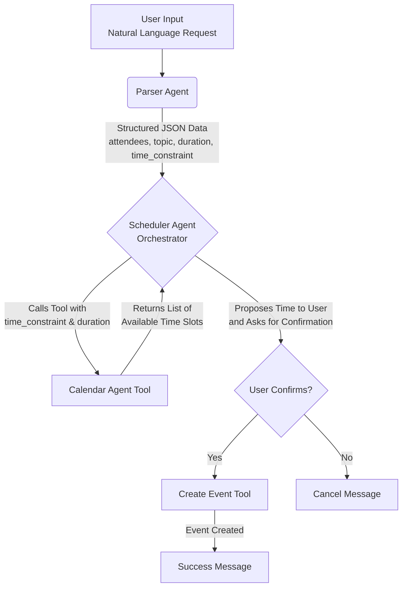

# CalPal - The Smart Meeting Scheduler Agent

CalPal is a command-line intelligent scheduling assistant that uses AI agents to parse natural language requests and manage your Google Calendar. Simply tell CalPal what meeting you want to schedule, and it will find a time and book it for you.

## 🎯 Features

- **Natural Language Processing**: Describe your meeting in plain English (e.g., "Lunch with Alex next Thursday at 1pm").
- **Calendar Integration**: Directly checks your Google Calendar's availability to find a free slot.
- **Automated Scheduling**: Creates calendar events with attendees, topic, and duration automatically.
- **Agent-Based Architecture**: Built using LangChain, showcasing a clear multi-agent workflow.

## 🤖 How It Works (Agent Architecture)

CalPal uses a system of specialized agents that work together to complete the scheduling task.


**1. Parser Agent**: Uses Google's Gemini Pro to convert the user's natural language input into structured JSON data.

**2. Scheduler Agent (Orchestrator)**: The main agent that receives the parsed data and coordinates the scheduling workflow.

**3. Calendar Agent**: Handles Google Calendar operations including:
   - `find_available_slots()`: Find available meeting times
   - `create_event()`: Book the event on the calendar

## 🛠️ Technology Stack

- **Framework**: LangChain
- **LLM**: Google Gemini Pro
- **Calendar API**: Google Calendar API
- **Language**: Python 3.8+
- **Authentication**: OAuth 2.0

## 🚀 Quick Start

### Installation

1. **Clone and install CalPal:**
   ```bash
   git clone https://github.com/aaronGeb/calpal-agent.git
   cd calpal-agent
   chmod +x scripts/install.sh
   ./scripts/install.sh
   ```

2. **Set up your API keys:**
   ```bash
   # Google Generative AI API Key (required)
   export GOOGLE_GENERATIVE_AI_API_KEY="your-google-ai-api-key"
   
   # Google Calendar API (required)
   # Download credentials.json from Google Cloud Console
   # Place it in the CalPal directory
   ```

2. **Run your first meeting:**
   ```bash
   calpal schedule "Lunch with Alex next Thursday at 1pm"
   ```

## 📁 Project Structure

```
calpal-agent/
├── calpal/                    # Main package
│   ├── core/                  # Core functionality
│   │   ├── models.py          # Data models
│   │   ├── parser_agent.py    # Natural language parsing
│   │   ├── calendar_agent.py  # Google Calendar integration
│   │   └── scheduler_agent.py # Workflow orchestration
│   ├── utils/                 # Utility functions
│   ├── exceptions/            # Custom exceptions
│   └── cli.py                 # Command-line interface
├── tests/                     # Test suite
├── examples/                  # Usage examples
├── docs/                      # Documentation
├── config/                    # Configuration files
├── scripts/                   # Build and utility scripts
└── requirements.txt           # Python dependencies
```

### Usage Examples

```bash
# Schedule a meeting
calpal schedule "Team standup tomorrow at 9am"

# Check available slots
calpal check 60 "next week"

# Get help
calpal --help
```

## 🔧 Setup Details

### Google Generative AI API Setup
1. Go to [Google AI Studio](https://makersuite.google.com/app/apikey)
2. Create a new API key
3. Set it as an environment variable: `export GOOGLE_GENERATIVE_AI_API_KEY="your-key"`

### Google Calendar API Setup
1. Go to [Google Cloud Console](https://console.cloud.google.com/)
2. Create a new project or select existing
3. Enable the Google Calendar API
4. Create OAuth 2.0 credentials (Desktop application)
5. Download the `credentials.json` file
6. Place it in your CalPal directory

## 🏗️ Architecture

CalPal is built with a clean, modular architecture:

- **Parser Agent**: Converts natural language to structured data using Google Gemini Pro
- **Calendar Agent**: Handles Google Calendar operations and availability checking
- **Scheduler Agent**: Orchestrates the complete scheduling workflow
- **CLI Interface**: User-friendly command-line interface
- **Core Models**: Type-safe data models for meetings, time slots, and events

## 🧪 Testing

Run the test suite to verify everything is working:

```bash
# Run all tests
python tests/test_calpal.py

# Run parsing tests specifically
python tests/test_parsing.py

# Run with pytest (if installed)
pytest tests/
```

## 📚 Documentation

- **[API Documentation](docs/API.md)** - Complete API reference
- **[Development Guide](docs/DEVELOPMENT.md)** - Development setup and guidelines
- **[Examples](examples/)** - Usage examples and code samples

## 🤝 Contributing

1. Fork the repository
2. Create a feature branch: `git checkout -b feature/amazing-feature`
3. Make your changes
4. Run tests: `python tests/test_calpal.py`
5. Commit your changes: `git commit -m 'Add amazing feature'`
6. Push to the branch: `git push origin feature/amazing-feature`
7. Open a Pull Request

## 📄 License

This project is licensed under the MIT License - see the [LICENSE](LICENSE) file for details.

## 🔧 Troubleshooting

### Common Issues

**1. "GOOGLE_GENERATIVE_AI_API_KEY is required"**
- Make sure you've set the environment variable: `export GOOGLE_GENERATIVE_AI_API_KEY="your-key"`
- Or create a `.env` file with your API key

**2. "Google credentials file not found"**
- Download `credentials.json` from Google Cloud Console
- Place it in the CalPal root directory

**3. "404 models/gemini-pro is not found"**
- This is a known issue with Google AI API
- The system will fall back to simple parsing, which still works

**4. Import errors after restructuring**
- Make sure you've installed the package: `pip install -e .`
- Check that you're using the correct import paths

### Getting Help

- Check the [API Documentation](docs/API.md) for detailed usage
- Look at [examples](examples/) for code samples
- Open an issue on GitHub for bugs or feature requests

## 🙏 Acknowledgments

- [LangChain](https://langchain.com/) for the agent framework
- [Google AI](https://ai.google/) for the Gemini Pro model
- [Google Calendar API](https://developers.google.com/calendar) for calendar integration